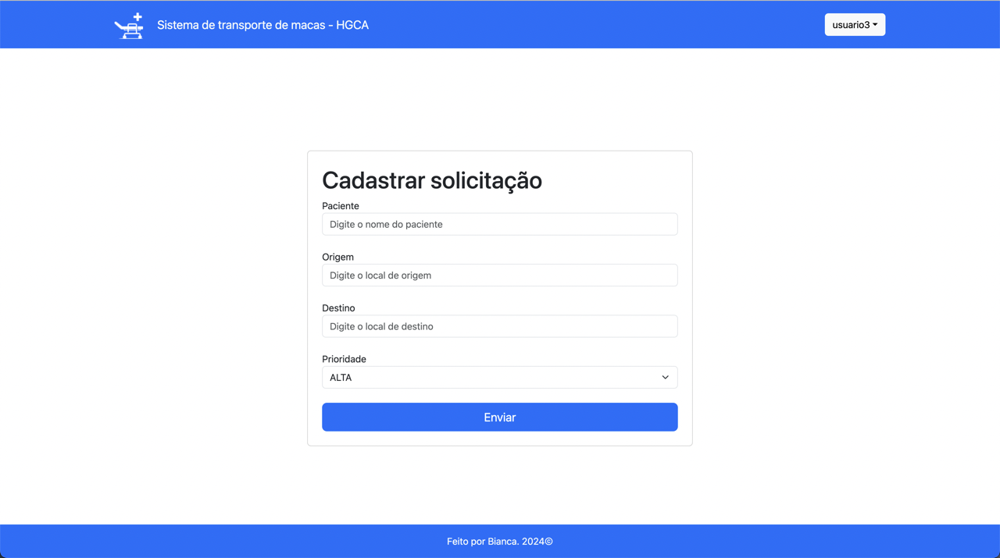
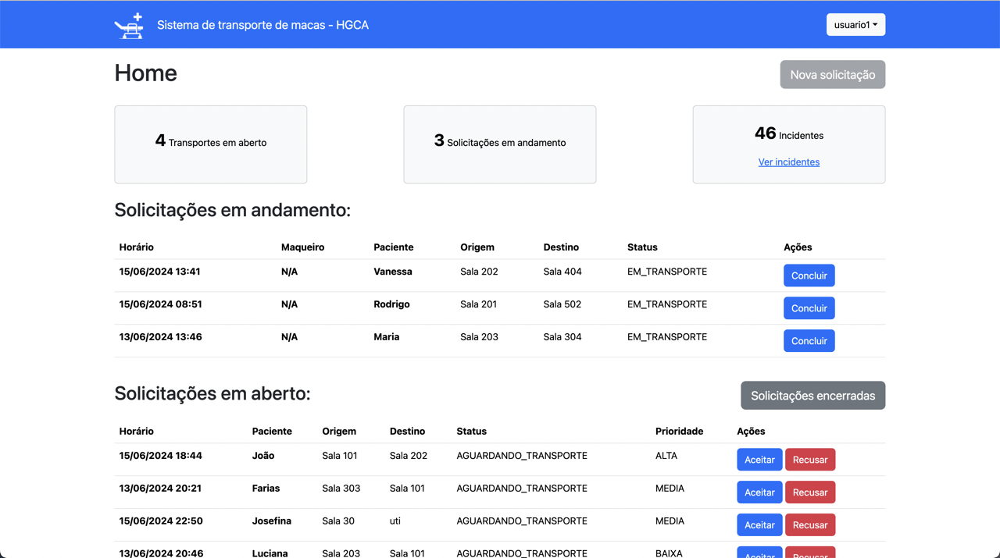
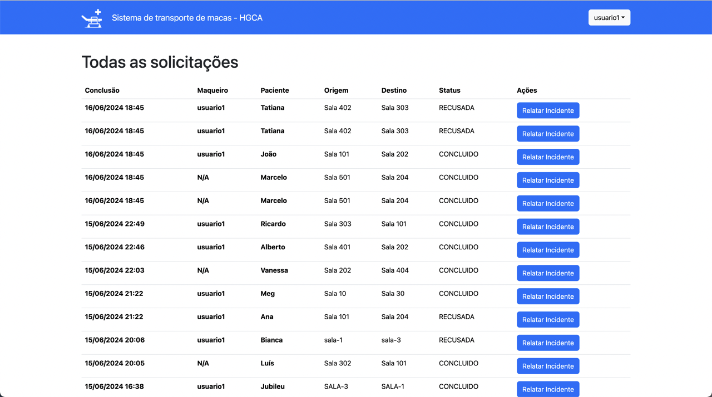
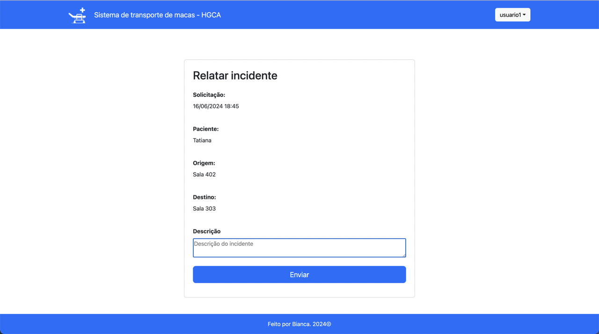
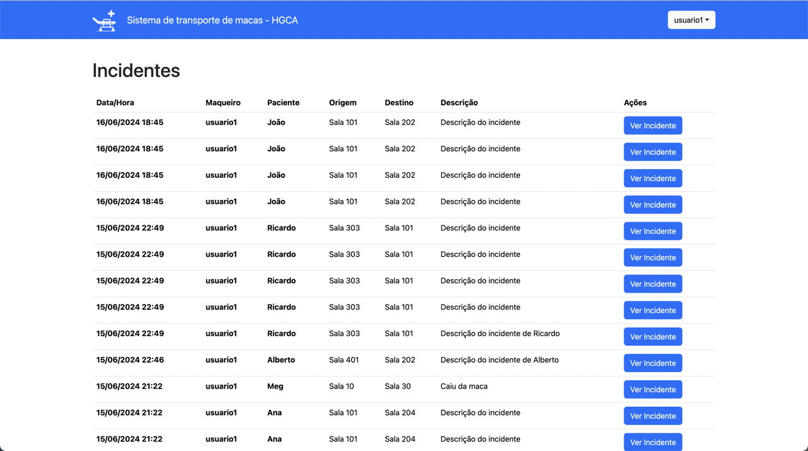

# Sistema de transporte de macas

Sistema apresentado ao Projeto Extensionista Integrador em POO (Programação Orientada a Objetos) do curso de Análise e Desenvolvimento de Sistemas da Unifan.
O projeto consiste em uma aplicação web MVC em Java e Spring Boot, banco de dados MySQL e HTMl/Bootstrap para as views.

## Objetivo

- O objetivo era criar um sistema onde maqueiros poderiam receber e visualizar as solicitações de transporte de pacientes, ter a opção de aceitar ou recusar uma solicitação e armazenar um histórico dessas solicitações.
- As solicitações devem conter um status a ser atualizaado conforme o andamento do transporte e ser ordenadas por urgência.
- Os profissionais devem também ter a opção de relatar incidentes ocorridos durante o transporte.
- Restrição de acesso a funcionários autorizados com mecanismos de autenticação e autoriração.

## Funcionalidades

- Rotas protegidas por autenticação via login
  
- Função de Criar novas solicitações disponível apenas para profissionais de saúde autorizados
  
- Funções de aceitar, recusar e concluir transações de transporte disponível apenas para usuários do tipo Maqueiro, com troca de status e tabelas instântanea conforme as ações do profissional
  
- Histórico de solicitações disponível para todos os usuários ordenada por mais recentes
  
- Relatar um incidente após conlusão do transporte e acesso a lista de incidentes
 
 

## Pré-requisitos

Certifique-se de ter os seguintes softwares instalados em sua máquina:

- **Java Development Kit (JDK) 17**
- **Apache Maven**

## Instalação

### Clonando o Repositório

1. Clone o repositório do projeto:

    ```bash
    git clone https://github.com/biancasanches-dev/sistema-de-transporte-de-macas
    cd seu-projeto
    ```

### Configurando o Projeto

2. Configure o arquivo `application.properties` com as configurações do banco de dados e outras configurações necessárias. Crie ou edite o arquivo `src/main/resources/application.properties`:

    ```properties
    # Exemplo de configuração para o banco de dados H2
    spring.datasource.url=jdbc:h2:mem:testdb
    spring.datasource.driverClassName=org.h2.Driver
    spring.datasource.username=sa
    spring.datasource.password=password
    spring.jpa.database-platform=org.hibernate.dialect.H2Dialect

    # Outras configurações necessárias
    ```
### Construindo e Executando a Aplicação

4. Construa o projeto com Maven:

    ```bash
    mvn clean install
    ```

5. Execute a aplicação Spring Boot:

    ```bash
    mvn spring-boot:run
    ```

### Acessando a Aplicação

6. Abra seu navegador e acesse:

    ```
    http://localhost:8080
    ```

### Estrutura do Projeto

- `src/main/java`: Código-fonte Java
- `src/main/resources`: Arquivos de configuração e recursos estáticos
- `src/main/resources/templates`: Arquivos HTML

### Tecnologias Utilizadas

- Spring Boot
- Java 17
- Apache Maven
- MySQL


## Uso

1- Para gerar dados de teste para o funcionamento do programa pode-se criar um componente que insere os dados diretamente usando código Java. Crie uma classe que implemente CommandLineRunner ou ApplicationRunner e anote-a com @Component.


## Contribuição

1. Fork o projeto
2. Crie uma nova branch (`git checkout -b feature/nome-da-feature`)
3. Faça commit das suas alterações (`git commit -am 'Adicione uma nova feature'`)
4. Faça push para a branch (`git push origin feature/nome-da-feature`)
5. Abra um Pull Request

